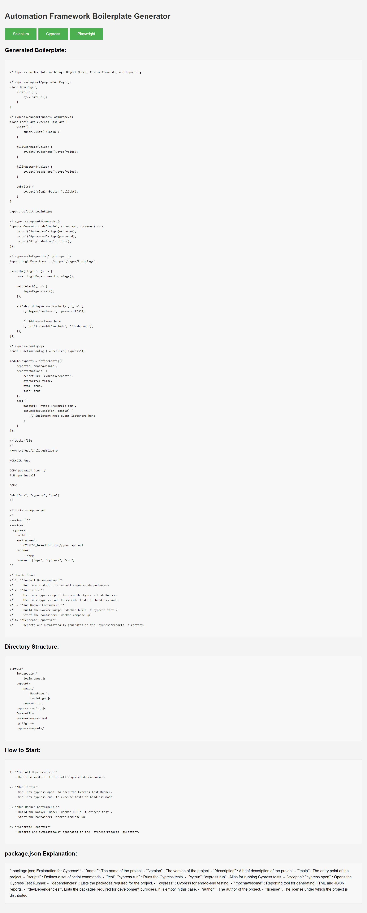

# Automation Framework Boilerplate Generator

Welcome to the **Automation Framework Boilerplate Generator**! This project, developed and maintained by **Yousaf**, provides a quick-start template for generating boilerplate code for popular automation testing frameworks: **Selenium**, **Cypress**, and **Playwright**. Whether you're starting a new project or need a reference implementation, this tool will set up your testing environment with a clean and organized structure.

## Features

- **Selenium**: Boilerplate with Page Object Model and custom commands.
- **Cypress**: Boilerplate with Page Object Model, custom commands, and integrated reporting.
- **Playwright**: Boilerplate with Page Object Model, custom commands, and reporting.

## Screensot



## Getting Started

To get started with the boilerplate generator, follow these steps:

### Clone the Repository

```bash
git clone https://github.com/syedyousafraza/framework-Builder.git
cd framework-Builder

Install Dependencies
Install the necessary dependencies based on the selected framework. You can generate boilerplate for a specific framework by running the generateBoilerplate function in the provided index.html file.

Generate Boilerplate
Open index.html in your browser and click on the desired framework button (Selenium, Cypress, or Playwright) to generate boilerplate code and see the associated directory structure.

Set Up Your Project
Follow the instructions provided for each framework to set up your project, run tests, and generate reports.

How It Works
The generator provides boilerplate code and directory structure for three popular automation frameworks:

Selenium: Uses JavaScript and the Selenium WebDriver for browser automation. The boilerplate includes a BasePage class, a LoginPage class, and a sample test setup with Mocha and Allure reporting.

Cypress: An end-to-end testing framework with built-in support for Page Object Model and custom commands. The boilerplate includes the basic structure for Cypress tests, configuration, and Docker setup.

Playwright: Provides a versatile testing framework with support for multiple browsers. The boilerplate includes a BasePage class, a LoginPage class, and configuration for Playwright with Docker support.

Contributing
I welcome contributions to this project! If you have suggestions, improvements, or bug fixes, please follow these steps:

Fork the repository.
Create a new branch for your changes.
Make your changes and test them thoroughly.
Submit a pull request with a description of your changes.